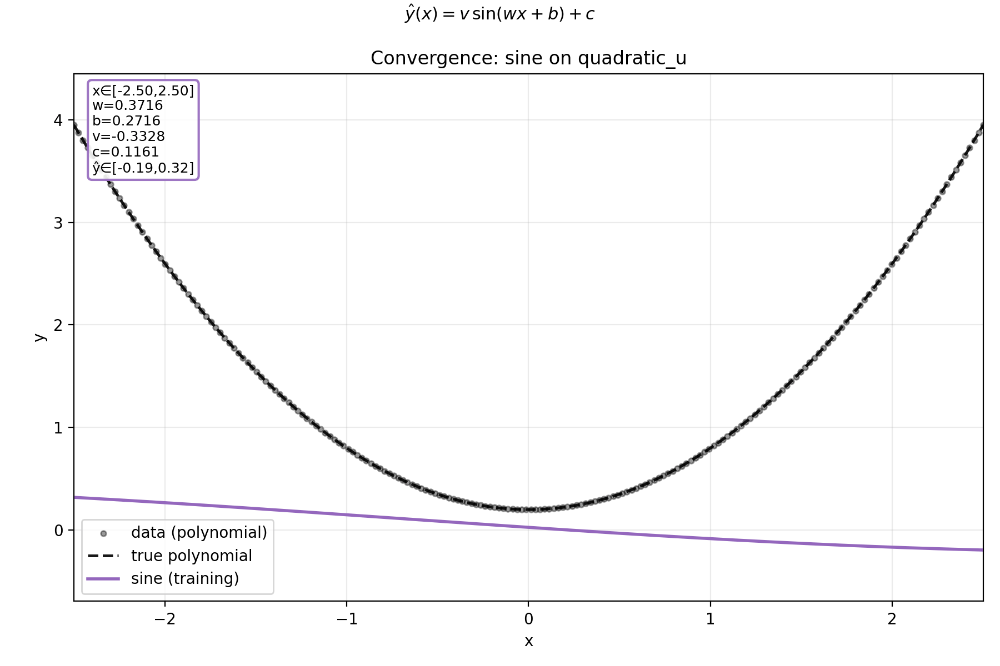
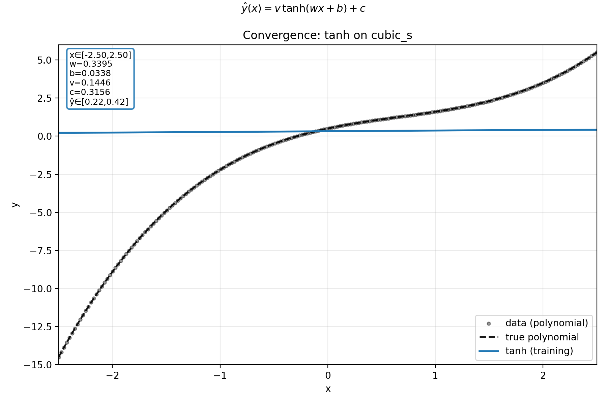
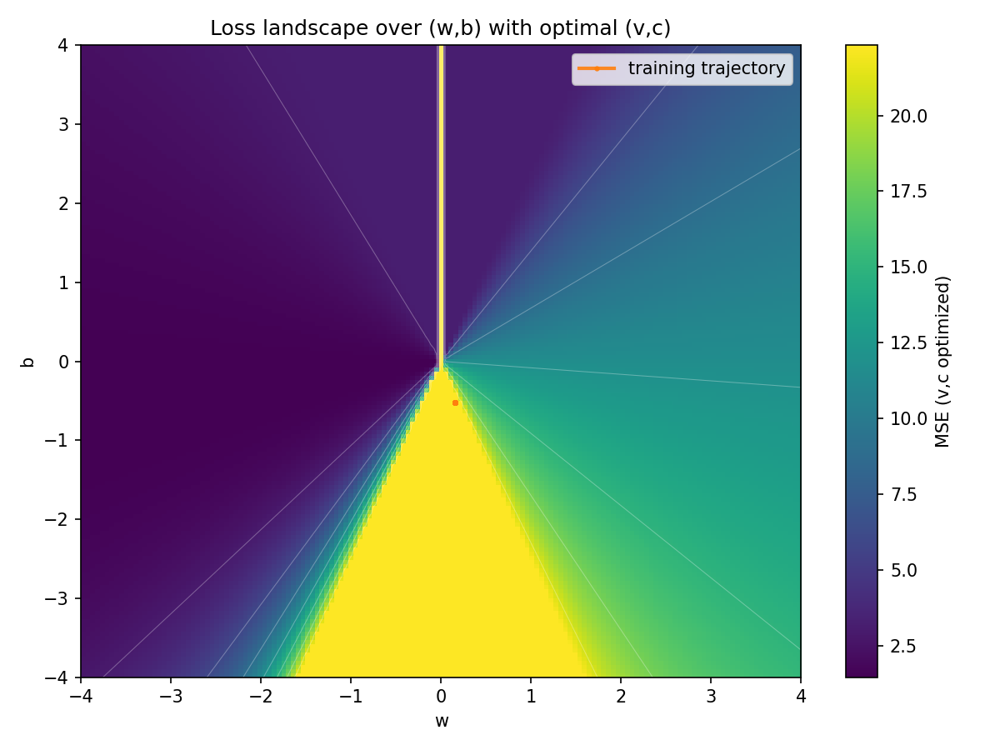

# activation-functions

A minimal playground to study activation functions with single-neuron and tiny-MLP models. Includes static plots, convergence GIFs, and a benchmark across activations and target polynomials.

## Setup

```bash
python3 -m venv .venv
source .venv/bin/activate
python -m pip install -r requirements.txt
```

## Scripts

- `fit_single_neuron.py`: Train a single hidden neuron (choose activation) to fit a polynomial. Produces static plots and optional GIFs.
- `relu_explore.py`: ReLU-only exploration (activation/derivative, static fit, convergence GIF, parameter trajectories, (w,b) loss heatmap).
- `sigmoid_explore.py`: Single-parameter model `y = σ(w x)` with a fit figure and a two-panel convergence GIF (fit + `w` trajectory).
- `benchmark_activations.py`: Compare 6 activations (`tanh`, `relu`, `sigmoid`, `leaky_relu`, `sine`, `identity`) over multiple polynomials. Produces per-case figures/GIFs and a Markdown report.

## Quick start

```bash
# Single-neuron, tanh vs relu examples
python fit_single_neuron.py

# ReLU-only visuals
python relu_explore.py

# Sigmoid-only (y = σ(w x))
python sigmoid_explore.py

# Full benchmark across activations and polynomials
python benchmark_activations.py
```

Outputs are written under `outputs/`:
- ReLU visuals: `outputs/relu/`
- Sigmoid visuals: `outputs/sigmoid/`
- Benchmark: `outputs/benchmark/` (per-polynomial/per-activation folders plus `REPORT.md`)

## Benchmark summary

We train a single hidden neuron with linear output for each activation and target polynomial. Loss: mean squared error (MSE). The report with inline previews is at `outputs/benchmark/REPORT.md`.

Example winners on the generated run (your results may vary with randomness):

| polynomial   | best activation | best MSE |
|--------------|-----------------|---------:|
| linear_pos   | identity        | 0.0000   |
| quadratic_u  | relu            | ~0.96    |
| cubic_s      | leaky_relu      | ~1.42    |
| cubic_neg    | identity        | ~1.76    |
| quartic_w    | leaky_relu      | ~0.15    |

Why these patterns?
- Identity excels on linear-like targets (no nonlinearity needed).
- ReLU often approximates convex shapes (e.g., upward quadratics) via a hinge + scaling.
- Leaky ReLU and sine can better capture asymmetric or oscillatory features; leaky ReLU avoids dead zones of pure ReLU.
- Tanh and sigmoid are bounded and can be strong for saturating shapes; with a single neuron, they cannot represent polynomials exactly.

## Tutorial: Visual gallery (all images with explanations)

Each fit figure has: a figure-level header with the model, an on-plot box listing x-range (top), parameters (`w, b, v, c`) in order, and predicted ŷ-range (bottom). GIFs animate training snapshots.

### Benchmark: single-neuron across activations and polynomials
- Dataset note: PNGs are shown inline. GIFs are now shown inline as well.

#### linear_pos
| Activation | Fit (PNG) | GIF |
|--|--|--|
| tanh |  |  |
| relu |  |  |
| sigmoid |  |  |
| leaky_relu |  |  |
| sine |  |  |
| identity |  |  |

- Explanation: Linear target; `identity` matches exactly; other activations approximate via their nonlinearity.

#### quadratic_u
| Activation | Fit (PNG) | GIF |
|--|--|--|
| tanh |  |  |
| relu |  |  |
| sigmoid |  |  |
| leaky_relu |  |  |
| sine |  |  |
| identity |  |  |

- Explanation: Upward-convex; `relu`/`leaky_relu` emulate convexity via a hinge; bounded activations may underfit with one neuron.

#### cubic_s
| Activation | Fit (PNG) | GIF |
|--|--|--|
| tanh |  |  |
| relu |  |  |
| sigmoid |  |  |
| leaky_relu |  |  |
| sine |  |  |
| identity |  |  |

- Explanation: S-shaped cubic; `leaky_relu` captures asymmetry; `tanh`/`sigmoid` are bounded, so they match locally.

#### cubic_neg
| Activation | Fit (PNG) | GIF |
|--|--|--|
| tanh |  |  |
| relu |  |  |
| sigmoid |  |  |
| leaky_relu |  |  |
| sine |  |  |
| identity |  |  |

- Explanation: Negative-slope cubic region; `identity` follows the broad linear trend best with a single unit.

#### quartic_w
| Activation | Fit (PNG) | GIF |
|--|--|--|
| tanh |  |  |
| relu |  |  |
| sigmoid |  |  |
| leaky_relu |  |  |
| sine |  |  |
| identity |  |  |

- Explanation: “W” shape; `leaky_relu` fits best thanks to non-zero negative slope.

### ReLU exploration (dedicated)
-  — ReLU(z) and derivative ReLU′(z) vs z.
-  — Single-neuron ReLU best fit with ordered annotation.
-  — ReLU training over snapshots; annotation updates each frame.
-  — Snapshot trajectories for w, b, v, c.
-  — MSE over (w,b) with optimal (v,c), training trajectory overlaid.

### Sigmoid exploration (y = σ(w x))
-  — Best fit for `σ(w x)`; annotation shows x-range, w, ŷ-range.
-  — Two-panel: Left fit; Right `w` trajectory with a moving marker.

### Extras from earlier runs
-  — Single-neuron comparison across activations on a fixed polynomial.
-  —  — Tanh single-neuron.
-  —  — ReLU single-neuron.
-  —  — Tiny tanh-MLP.
-  —  — Original tanh-only.

## Notes

- All models are intentionally tiny to stay interpretable. Use `hidden_sizes` or `epochs`/`lr` in scripts to adjust capacity or training length.
- Plots include figure-level function forms and annotation boxes in the order: x-range (top) → parameters → predicted y-range (bottom).
- GIFs record snapshots every N steps for a short, readable animation.

## License

MIT
